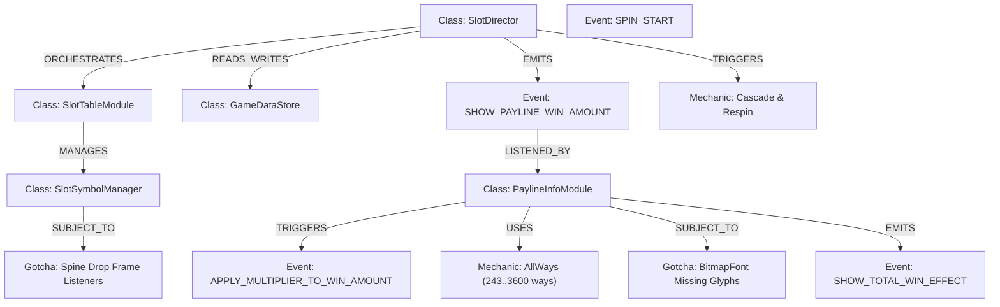

# 📋 KẾ HOẠCH TỔNG THỂ: XÂY DỰNG HỆ THỐNG TRI THỨC CHUYÊN SÂU `MCP-FWCC` (CC-COMMON & COCOS 2.4)

Tài liệu này là **Kế hoạch hành động chi tiết (Action Plan)** nhằm xây dựng kho tri thức toàn diện, đa chiều cùng hệ thống Đồ thị ngữ nghĩa (Knowledge Graph) cho SDK Slot Platform (`cc-common`) và Cocos Creator 2.4.

---

## 🎯 I. MỤC TIÊU CỦA HỆ THỐNG TRI THỨC

Hệ thống được thiết kế để **giải đáp tức thì, chính xác và chuyên sâu** cho mọi nhu cầu phát triển game Slot:
1. **Kiến trúc & Vòng đời**: Hiểu sâu luồng khởi động (Bootstrap), Vòng đời ván quay (Spin Loop), Cơ chế Dependency Injection (`eno.inject`), Quản lý bộ nhớ & Object Pooling.
2. **Cơ chế Slot (Slot Mechanics)**: Nắm rõ 25+ cơ chế cốt lõi (AllWays, Megaways, Cascade, Cluster, Gigablox, Nudge, Shifting Reels, Multiplier, Buy Feature).
3. **Thành phần GUI & Cutscenes**: Cách cấu hình và tùy biến Spin Button, Bet Selector, Wallet, Payline Info, Win Levels (Big/Mega/Super Win), Jackpot Wheel, Free Game Intro.
4. **Từ điển Bus Sự kiện (Event Bus Dictionary)**: Danh mục toàn bộ các sự kiện (`SlotEvent`, `GameUIEvent`), bên phát (Emitter), bên nhận (Listener) và định dạng payload dữ liệu.
5. **Quy tắc vàng & Cạm bẫy Cocos Creator 2.4**: Cơ chế render BitmapFont, Spine 3.8 state machine & drop events, Component reflection (`cc.js.getClassName`), WebGL draw calls, Coordinate conversions.
6. **Thực hành (Recipes) & Sửa lỗi (Troubleshooting)**: Hướng dẫn step-by-step thêm Symbol mới, thêm Feature mới, xử lý sự cố hiển thị tiền, debug lỗi lệch ma trận.

---

## 🏛️ II. CẤU TRÚC 7 TẦNG TRI THỨC (7-LAYER KNOWLEDGE VAULT)

Toàn bộ tài liệu được tổ chức có cấu trúc tại thư mục: `mcp/mcp-fwcc/docs/`

```text
mcp/mcp-fwcc/docs/
├── 00_architecture_and_lifecycle/   # [TẦNG 1] Kiến trúc cốt lõi, DI, IoC & Vòng đời Spin
│   ├── 01_system_architecture.md    # 4 Trụ cột kiến trúc (Director, Table, Payline, Store)
│   ├── 02_dependency_injection.md   # Hướng dẫn eno.inject, eno.provide, applyInjections
│   └── 03_spin_lifecycle_loop.md    # Vòng đời chi tiết từ Spin Button ➔ Table ➔ Payout ➔ Respin
│
├── 01_slot_mechanics_deepdive/      # [TẦNG 2] 25+ Cơ chế Slot chuyên sâu
│   ├── 01_allways_and_paylines.md   # AllWays (243..4096 ways), Paylines tĩnh, Cluster, ScatterPay
│   ├── 02_cascade_and_tumbling.md   # CompositeCascade, HorizontalCascade, RemovedSymbol, Gravity
│   ├── 03_megaways_and_expanding.md # Megaway, MegaReel, Dynamic row heights
│   ├── 04_wilds_and_multipliers.md  # StickySymbol, TransformSymbol, Multiplier, MultiplierReel
│   └── 05_special_mechanics.md      # BuyFeature, Gigablox, NudgeReel, InstantCash, CollectionItem
│
├── 02_slot_modules_and_gui/         # [TẦNG 3] Toàn bộ GUI, Cutscenes, Popups & Table
│   ├── 01_director_modules.md       # BaseGameDirector, NormalGameDirector, FreeGameDirector
│   ├── 02_table_and_reel_system.md  # SlotTableModule, SlotReelModule, SlotSymbolManager, Pools
│   ├── 03_gui_controls.md           # SpinButton, BetSelection, WalletLabel, Turbo, AutoSpin
│   ├── 04_payline_and_win_bar.md    # PaylineInfoModule, MoneyFormatter, MoneyTween, Win levels
│   └── 05_cutscenes_and_popups.md   # WinEffect (Big/Mega/Super), JackpotWin, Setting, BetHistory
│
├── 03_events_and_data_flow/         # [TẦNG 4] Từ điển Event Bus & GameDataStore
│   ├── 01_event_bus_dictionary.md   # Toàn bộ danh mục sự kiện (Emitter, Listener, Payload)
│   ├── 02_game_data_store.md        # Cấu trúc GameDataStore, playSession, session resumes
│   └── 03_network_and_mock.md       # Socket, HTTP, Packet serialization, Mock transport
│
├── 04_cocos24_gotchas_and_rules/    # [TẦNG 5] Quy tắc vàng & Cạm bẫy Cocos Creator 2.4
│   ├── 01_bitmapfont_rendering.md   # Quy tắc Atlas BitmapFont, lỗi Missing Glyphs làm đen chữ
│   ├── 02_spine_runtime_rules.md    # Spine 3.8 trackEntry, animation listener & fallback completion
│   ├── 03_component_reflection.md   # cc.js.getClassName() vs constructor.name bị minified
│   └── 04_performance_drawcalls.md  # Tối ưu Draw Call, Node hierarchy, Tween actions
│
├── 05_recipes_and_troubleshooting/  # [TẦNG 6] Hướng dẫn Step-by-Step & Sửa lỗi thực chiến
│   ├── 01_recipe_add_new_symbol.md  # Các bước thêm Symbol từ Config ➔ Sprite/Spine ➔ Pool
│   ├── 02_recipe_create_feature.md  # Các bước tạo Feature game mới (Free Spin, Bonus Game)
│   ├── 03_recipe_handle_multi.md    # Các bước đồng bộ Hệ số nhân với Spine tiền bay
│   └── 04_troubleshooting_faq.md    # Danh mục các lỗi phổ biến và cách khắc phục tức thì
│
└── cc_api_reference/                # [TẦNG 7] 307+ Module API bóc tách trực tiếp từ mã nguồn
    ├── cc_core_lib/                 # Utilities, SoundManager, StateMachine, Decorators
    ├── cc_network/                  # Network client, Serialization, Socket flow
    ├── cc_slot_module/              # Toàn bộ class, properties, methods trong cc-slot-module
    ├── cc_slot_mechanics/           # Toàn bộ mechanics classes
    └── cc_slot_features/            # Toàn bộ feature modules
```

---

## 🕸️ III. ĐỒ THỊ QUAN HỆ NGỮ NGHĨA (KNOWLEDGE GRAPH)

Graph Engine lưu trữ mạng lưới liên kết giữa các thực thể cốt lõi:



---

## 🛠️ IV. BỘ CÔNG CỤ MCP (MCP TOOL SUITE)

| Tên Tool | Tham số đầu vào | Mô tả chức năng |
| :--- | :--- | :--- |
| **`fwcc_search_docs`** | `query`, `category`, `limit` | Tìm kiếm mờ (fuzzy) tức thì trên toàn bộ 307+ modules và guides |
| **`fwcc_get_doc`** | `topicOrRelPath` | Lấy chi tiết tài liệu Markdown, code implementation và ví dụ |
| **`fwcc_get_class_api`** | `className` | Bóc tách chi tiết chữ ký Class, `@property`, decorators, methods |
| **`fwcc_get_related_topics`** | `concept` | Duyệt đồ thị Graph tìm các Module, Event, Mechanic và Gotcha liên quan |
| **`fwcc_trace_event_flow`** | `startEvent` | Truy vết toàn bộ luồng sự kiện từ lúc bắt đầu (Spin) đến kết thúc (Payout) |
| **`fwcc_explain_concept`** | `topic`, `detailLevel` | Tổng hợp tri thức giải thích sâu kết hợp Docs + Code + Graph |

---

## 🚀 V. LỘ TRÌNH TRIỂN KHAI THEO TỪNG BƯỚC

- [x] **Bước 1**: Tạo cấu trúc repository `mcp/mcp-fwcc` và liên kết GitHub `https://github.com/lam-ark/mcp-fwcc.git`.
- [x] **Bước 2**: Trích xuất AST tự động từ `assets/cc-common/` thành 307+ file Markdown API ban đầu.
- [x] **Bước 3**: Cấu hình MCP Server đa kênh (JSON-RPC HTTP + SSE Port `8925`) và đăng ký vào Gemini IDE (`.agents/mcp_config.json`).
- [ ] **Bước 4**: Biên soạn và xuất bản toàn bộ **6 Tầng Tri Thức Chuyên Sâu** (Architecture, Mechanics, GUI, Events, Gotchas, Recipes).
- [ ] **Bước 5**: Nâng cấp **Knowledge Graph Engine** với hơn 50 Node quan hệ liên kết đa chiều.
- [ ] **Bước 6**: Bổ sung 2 Tool MCP thông minh: `fwcc_trace_event_flow` và `fwcc_explain_concept`.
- [ ] **Bước 7**: Chạy kiểm thử toàn diện (Unit Tests & Multi-topic Queries) và commit/push lên GitHub.

---

*File tài liệu này được lưu tại:* `c:\Users\ADMIN\lamnino\cc20-new-all-in-one\mcp\mcp-fwcc\PLAN_FWCC_KNOWLEDGE_ENGINE.md`
