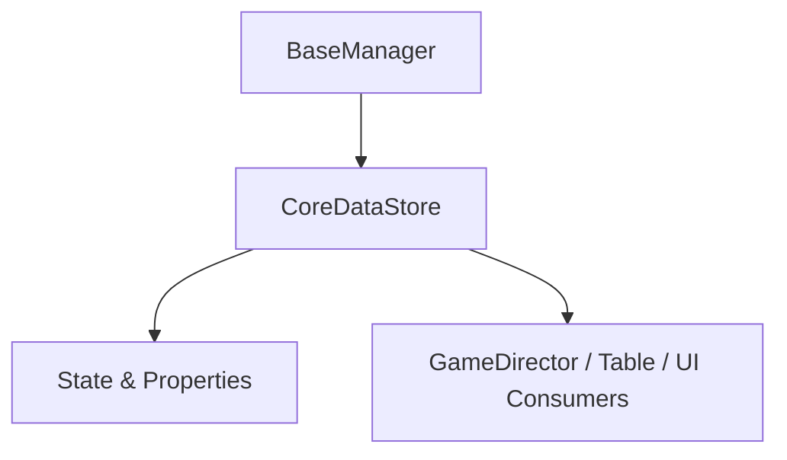

# 🏛️ `CoreDataStore` Architectural Role & Runtime Integration

- **Package Source**: `assets/cc-common/cc-core-lib/slot-base-logic`
- **Global Namespace Anchor**: `eno.CoreDataStore` / `globalThis.eno.CoreDataStore`
- **Inheritance Hierarchy**: `CoreDataStore` ➔ `BaseManager`

---

## 1. Architectural Mission

`CoreDataStore` is an essential logic component within **`slot-base-logic`**. It encapsulates dedicated business rules, lifecycle hooks, and optimized runtime performance tailored for high-framerate ($60\text{ FPS}$) Cocos Creator 2.4 slot games.

---

## 2. Core Responsibilities

1. **Deterministic Lifecycle Orchestration**:
   - Manages state machine transitions with zero uncontrolled side-effects.
2. **Memory & Performance Optimization**:
   - Zero-allocation design preventing Garbage Collection (GC) spikes during high-frequency spin loops.
3. **Cross-Platform Resilience**:
   - Normalizes engine quirks between iOS WebAudio, Android touch dispatchers, and desktop WebGL canvas adapters.
