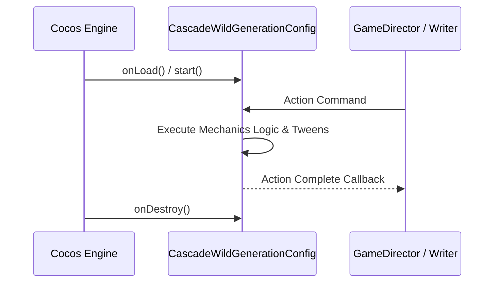

# 🔄 CascadeWildGenerationConfig Lifecycle & Sequence Flowchart

---

## 1. Lifecycle Sequence Diagram

```mermaid
sequenceDiagram
    participant Engine as Cocos Engine
    participant Module as CascadeWildGenerationConfig
    participant Director as GameDirector / Writer

    Engine->>Module: onLoad() / start()
    Director->>Module: Action Command
    Module->>Module: Execute Mechanics Logic & Tweens
    Module-->>Director: Action Complete Callback
    Engine->>Module: onDestroy()
```
