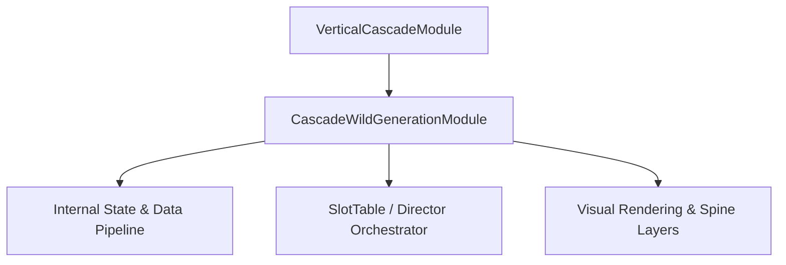

# 🏛️ `CascadeWildGenerationModule` Architectural Role & Mechanics Overview

- **Mechanics Package**: `assets/cc-common/cc-slot-mechanics/CascadeWildGeneration`
- **Source File**: `assets/cc-common/cc-slot-mechanics/CascadeWildGeneration/scripts/CascadeWildGenerationModule.ts`
- **Class Hierarchy**: `CascadeWildGenerationModule` ➔ `VerticalCascadeModule`
- **Subsystem Domain**: Cascade Explosion Wild Generator

---

## 1. Mathematical & Engineering Foundation

`CascadeWildGenerationModule` is a core runtime module within the **Cascade Explosion Wild Generator**.

> **Mathematical Foundation & Formulation**:  
> Spawns Wild symbol at the geometric centroid of winning combination clusters upon explosion.

---

## 2. Core Responsibilities & System Invariants

1. **State & Coordinate Calculation**:
   - Manages mathematical matrix models, reel coordinates, and bounding box calculations with zero memory leaks.
2. **Director & Writer Command Pipeline**:
   - Emits asynchronous step completion signals to `ScriptExecutor` to maintain uninterrupted $60\text{ FPS}$ spin loops.
3. **Event Bus Communication**:
   - Subscribes and publishes events: `SPAWN_CASCADE_WILD`, `WILD_BURST_ANIMATION`.
