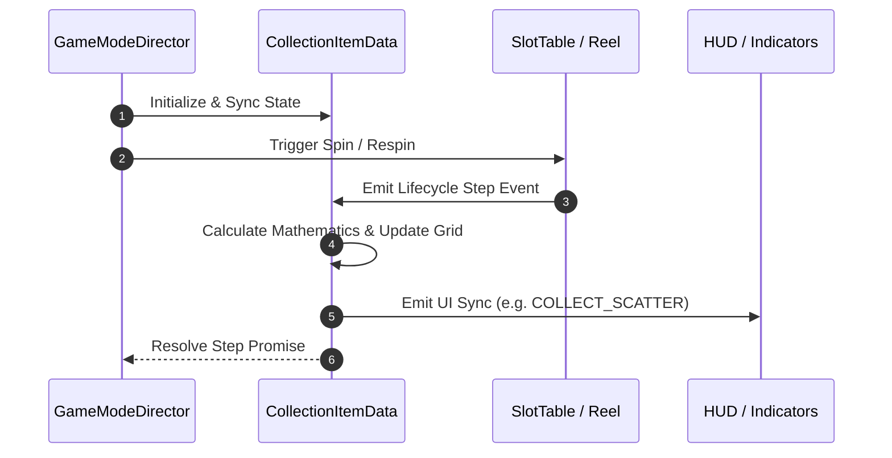

# 🔄 `CollectionItemData` Mechanics Game Flow & Execution Sequence

---

## 1. Sequence Execution Diagram

---

## 2. Execution Phases

1. **Phase 1: Pre-Spin State Initialization**:
   - Resets counters, caches previous matrix snapshots, and registers event listeners.
2. **Phase 2: Active Spin & Dynamic Mechanics Evaluation**:
   - Evaluates reel stops, bounding boxes, or cascade explosions.
3. **Phase 3: Settle & Post-Step Synchronization**:
   - Dispatches completion events to downstream modules.
