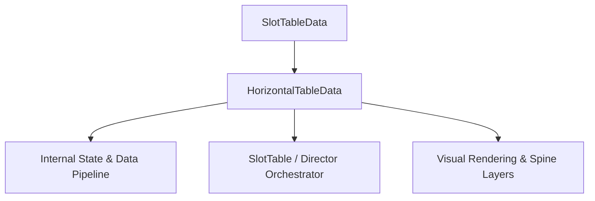

# 🏛️ `HorizontalTableData` Architectural Role & Mechanics Overview

- **Mechanics Package**: `assets/cc-common/cc-slot-mechanics/HorizontalReel`
- **Source File**: `assets/cc-common/cc-slot-mechanics/HorizontalReel/scripts/HorizontalTableData.ts`
- **Class Hierarchy**: `HorizontalTableData` ➔ `SlotTableData`
- **Subsystem Domain**: Horizontal Sub-Reel Mechanics

---

## 1. Mathematical & Engineering Foundation

`HorizontalTableData` is a core runtime module within the **Horizontal Sub-Reel Mechanics**.

> **Mathematical Foundation & Formulation**:  
> Orthogonal single-row sub-reel spanning across Reels 2, 3, 4, 5 with horizontal symbol translation kinematics: $X(t) = X_0 - v \cdot t$.

---

## 2. Core Responsibilities & System Invariants

1. **State & Coordinate Calculation**:
   - Manages mathematical matrix models, reel coordinates, and bounding box calculations with zero memory leaks.
2. **Director & Writer Command Pipeline**:
   - Emits asynchronous step completion signals to `ScriptExecutor` to maintain uninterrupted $60\text{ FPS}$ spin loops.
3. **Event Bus Communication**:
   - Subscribes and publishes events: `TABLE_STOP_SPIN_TOP`, `STACK_WILD_LANDED`, `HORIZONTAL_REEL_STOP`.
