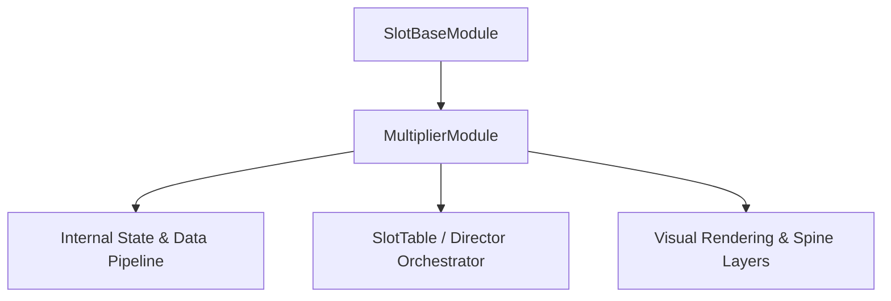

# 🏛️ `MultiplierModule` Architectural Role & Mechanics Overview

- **Mechanics Package**: `assets/cc-common/cc-slot-mechanics/Multiplier`
- **Source File**: `assets/cc-common/cc-slot-mechanics/Multiplier/scripts/MultiplierModule.ts`
- **Class Hierarchy**: `MultiplierModule` ➔ `SlotBaseModule`
- **Subsystem Domain**: Progressive Cascade Multiplier Engine

---

## 1. Mathematical & Engineering Foundation

`MultiplierModule` is a core runtime module within the **Progressive Cascade Multiplier Engine**.

> **Mathematical Foundation & Formulation**:  
> Step multiplier accumulation: $M_{t+1} = M_t + \Delta M$ on every consecutive cascade cascade step.

---

## 2. Core Responsibilities & System Invariants

1. **State & Coordinate Calculation**:
   - Manages mathematical matrix models, reel coordinates, and bounding box calculations with zero memory leaks.
2. **Director & Writer Command Pipeline**:
   - Emits asynchronous step completion signals to `ScriptExecutor` to maintain uninterrupted $60\text{ FPS}$ spin loops.
3. **Event Bus Communication**:
   - Subscribes and publishes events: `APPLY_MULTIPLIER_TO_WIN_AMOUNT`, `RESET_MULTIPLIER`, `SYNC_GAME_MULTIPLIER`.
