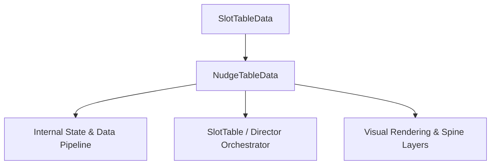

# 🏛️ `NudgeTableData` Architectural Role & Mechanics Overview

- **Mechanics Package**: `assets/cc-common/cc-slot-mechanics/NudgeReel`
- **Source File**: `assets/cc-common/cc-slot-mechanics/NudgeReel/scripts/NudgeTableData.ts`
- **Class Hierarchy**: `NudgeTableData` ➔ `SlotTableData`
- **Subsystem Domain**: Vertical Nudge-to-Win Mechanics

---

## 1. Mathematical & Engineering Foundation

`NudgeTableData` is a core runtime module within the **Vertical Nudge-to-Win Mechanics**.

> **Mathematical Foundation & Formulation**:  
> Vertical translation: $Y_{nudge} = \pm k \cdot \text{SymbolHeight}$ settling on winning paylines.

---

## 2. Core Responsibilities & System Invariants

1. **State & Coordinate Calculation**:
   - Manages mathematical matrix models, reel coordinates, and bounding box calculations with zero memory leaks.
2. **Director & Writer Command Pipeline**:
   - Emits asynchronous step completion signals to `ScriptExecutor` to maintain uninterrupted $60\text{ FPS}$ spin loops.
3. **Event Bus Communication**:
   - Subscribes and publishes events: `NUDGE_REEL_START`, `NUDGE_STEP_COMPLETE`.
