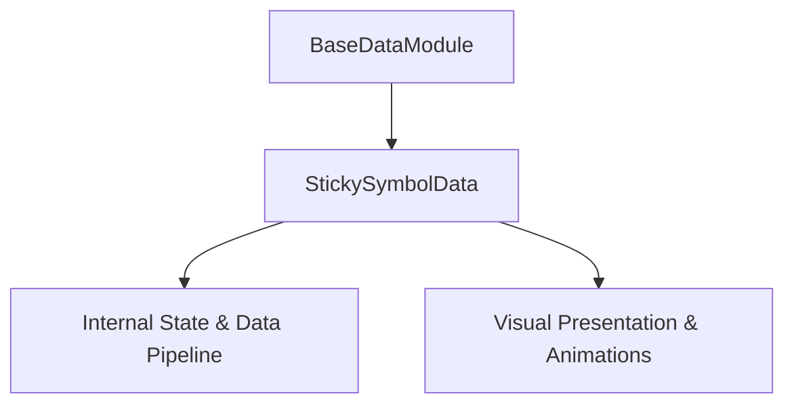

# 🏛️ StickySymbolData Architectural Role & Mechanics Overview

---

## 1. Architectural Mission

`StickySymbolData` is a core component of the `cc-slot-mechanics` package (`assets/cc-common/cc-slot-mechanics/StickySymbol/scripts/StickySymbolData.ts`).
- **Inheritance Chain**: `StickySymbolData` ➔ `BaseDataModule`
- **Primary Responsibility**: Provides specialized slot mechanics execution, coordinate mathematics, and state management for advanced slot games.

---

## 2. Key Responsibilities

1. **State & Physics Coordination**:
   - Implements game-specific algorithms and state mutations.
2. **Director & Writer Integration**:
   - Dispatches step completion callbacks to `ScriptExecutor` to maintain non-blocking async command queues.
