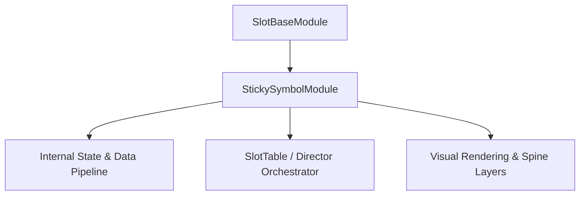

# 🏛️ `StickySymbolModule` Architectural Role & Mechanics Overview

- **Mechanics Package**: `assets/cc-common/cc-slot-mechanics/StickySymbol`
- **Source File**: `assets/cc-common/cc-slot-mechanics/StickySymbol/scripts/StickySymbolModule.ts`
- **Class Hierarchy**: `StickySymbolModule` ➔ `SlotBaseModule`
- **Subsystem Domain**: StickySymbol Mechanics Engine

---

## 1. Mathematical & Engineering Foundation

`StickySymbolModule` is a core runtime module within the **StickySymbol Mechanics Engine**.

> **Mathematical Foundation & Formulation**:  
> Specialized slot mechanics coordinate mathematics and state transitions.

---

## 2. Core Responsibilities & System Invariants

1. **State & Coordinate Calculation**:
   - Manages mathematical matrix models, reel coordinates, and bounding box calculations with zero memory leaks.
2. **Director & Writer Command Pipeline**:
   - Emits asynchronous step completion signals to `ScriptExecutor` to maintain uninterrupted $60\text{ FPS}$ spin loops.
3. **Event Bus Communication**:
   - Subscribes and publishes events: `MECHANIC_EVENT`.
