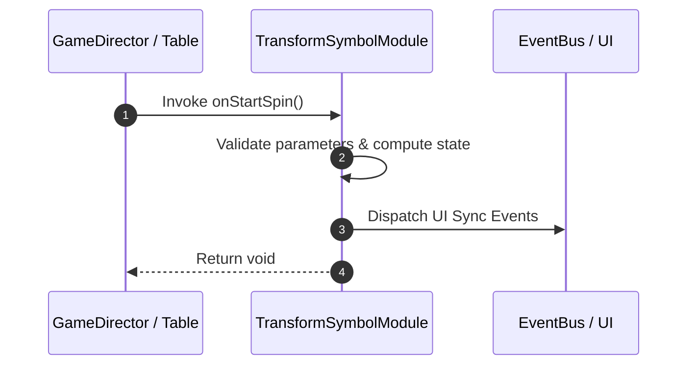

# 📖 `TransformSymbolModule.onStartSpin()`

---

## 1. Method Signature & Overview

```typescript
public onStartSpin(): void
```

- **Declaring Class**: `TransformSymbolModule` (`assets/cc-common/cc-slot-mechanics/TransformSymbol/scripts/TransformSymbolModule.ts`)
- **Source Code Location**: Lines 67 to 69
- **Execution Complexity**: $O(1)$ fast synchronous calculation or controlled timer Promise.

---

## 2. Complete Source Code Implementation

```typescript
	onStartSpin(): void {
		this.reset();
	}
```

---

## 3. Line-by-Line Code Breakdown

| Line # | Code Snippet | Technical Analysis & Engine Behavior |
| :---: | :--- | :--- |
| **67** | `onStartSpin(): void {` | Method entry signature declaring `onStartSpin()` with return type `void`. |
| **68** | `this.reset();` | Applies operational logic and state mutation. |
| **69** | `}` | Method exit boundary, closing block scope. |

---

## 4. Data Flow & State Lifecycle



---

## 5. Production Gotchas & Edge Cases

1. **Null Guarding**: Always ensure caller passes non-null parameters or handles undefined fallbacks.
2. **Fast-Stop Safety**: If user triggers fast-stop during execution, ensure timers are cancelled cleanly via `unscheduleAllCallbacks()`.
