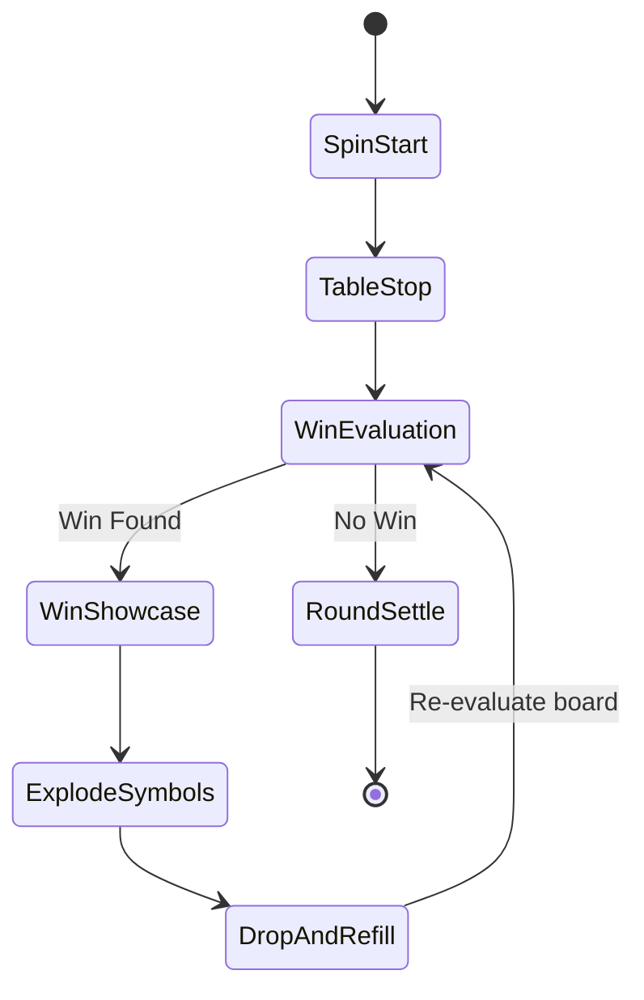

# 🔄 Cascade & Respin State Machine Choreography

---

## 1. Multi-Step Cascade Loop

```mermaid
stateDiagram-v2
    [*] --> SpinStart
    SpinStart --> TableStop
    TableStop --> WinEvaluation
    WinEvaluation --> WinShowcase: Win Found
    WinEvaluation --> RoundSettle: No Win
    WinShowcase --> ExplodeSymbols
    ExplodeSymbols --> DropAndRefill
    DropAndRefill --> WinEvaluation: Re-evaluate board
    RoundSettle --> [*]
```
