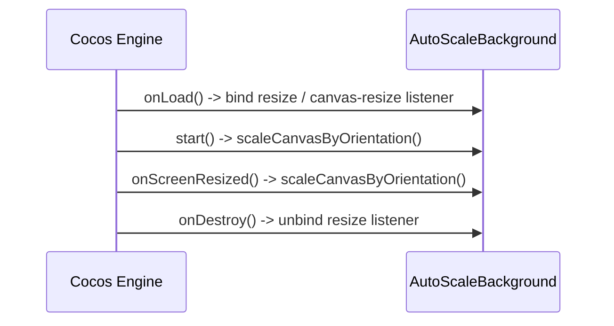

# 🔄 AutoScaleBackgroundModule Lifecycle Flowchart

---

## 1. Sequence

```mermaid
sequenceDiagram
    participant Engine as Cocos Engine
    participant ASB as AutoScaleBackground

    Engine->>ASB: onLoad() -> bind resize / canvas-resize listener
    Engine->>ASB: start() -> scaleCanvasByOrientation()
    Engine->>ASB: onScreenResized() -> scaleCanvasByOrientation()
    Engine->>ASB: onDestroy() -> unbind resize listener
```
