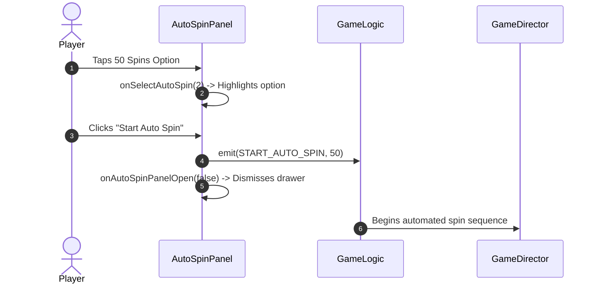

# 🔄 AutoSpinPanel Lifecycle Flowchart

---

## 1. Selection & Execution Flow

```mermaid
sequenceDiagram
    autonumber
    actor Player
    participant Panel as AutoSpinPanel
    participant Logic as GameLogic
    participant Dir as GameDirector

    Player->>Panel: Taps 50 Spins Option
    Panel->>Panel: onSelectAutoSpin(2) -> Highlights option
    Player->>Panel: Clicks "Start Auto Spin"
    Panel->>Logic: emit(START_AUTO_SPIN, 50)
    Panel->>Panel: onAutoSpinPanelOpen(false) -> Dismisses drawer
    Logic->>Dir: Begins automated spin sequence
```
