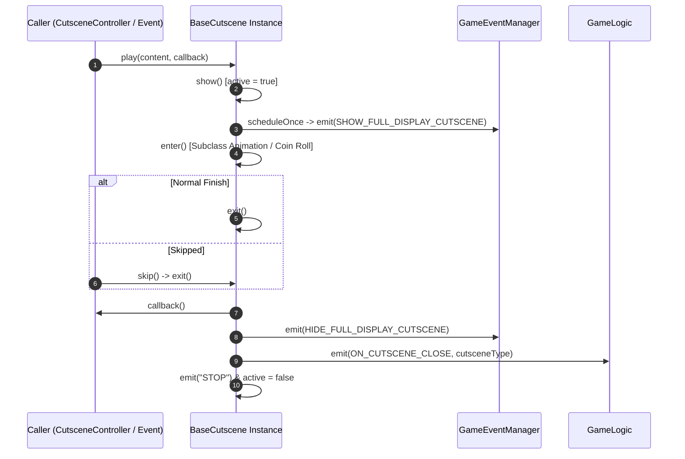

# 🔄 BaseCutscene Modal Lifecycle Sequence Flowchart

---

## 1. Sequence Flowchart

```mermaid
sequenceDiagram
    autonumber
    participant Caller as Caller (CutsceneController / Event)
    participant BC as BaseCutscene Instance
    participant EventMgr as GameEventManager
    participant GameLogic as GameLogic

    Caller->>BC: play(content, callback)
    BC->>BC: show() [active = true]
    BC->>EventMgr: scheduleOnce -> emit(SHOW_FULL_DISPLAY_CUTSCENE)
    BC->>BC: enter() [Subclass Animation / Coin Roll]
    
    alt Normal Finish
        BC->>BC: exit()
    else Skipped
        Caller->>BC: skip() -> exit()
    end
    
    BC->>Caller: callback()
    BC->>EventMgr: emit(HIDE_FULL_DISPLAY_CUTSCENE)
    BC->>GameLogic: emit(ON_CUTSCENE_CLOSE, cutsceneType)
    BC->>BC: emit("STOP") & active = false
```
