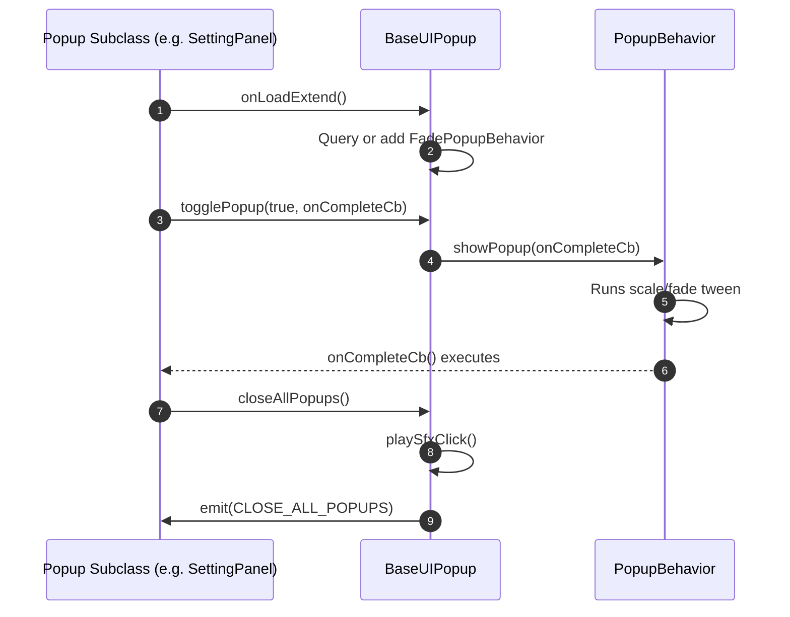

# 🔄 BaseUIPopup Lifecycle Flowchart

---

## 1. Sequence Flowchart

```mermaid
sequenceDiagram
    autonumber
    participant Sub as Popup Subclass (e.g. SettingPanel)
    participant Base as BaseUIPopup
    participant PB as PopupBehavior

    Sub->>Base: onLoadExtend()
    Base->>Base: Query or add FadePopupBehavior
    
    Sub->>Base: togglePopup(true, onCompleteCb)
    Base->>PB: showPopup(onCompleteCb)
    PB->>PB: Runs scale/fade tween
    PB-->>Sub: onCompleteCb() executes
    
    Sub->>Base: closeAllPopups()
    Base->>Base: playSfxClick()
    Base->>Sub: emit(CLOSE_ALL_POPUPS)
```
