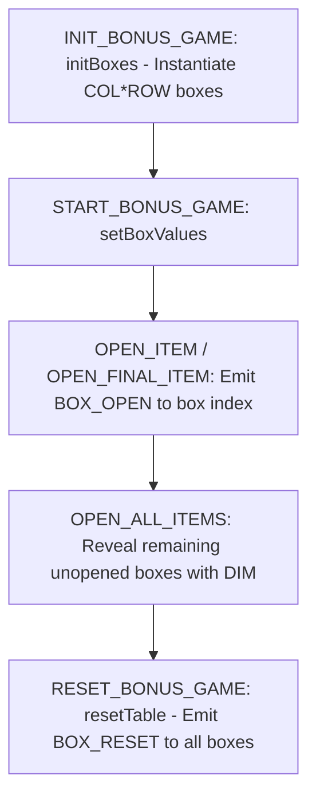

# 🌀 BonusGameTableModule Grid Lifecycle Phases Breakdown

## 1. Grid Lifecycle Flow

```mermaid
graph TD
    Init[INIT_BONUS_GAME: initBoxes - Instantiate COL*ROW boxes] --> SetVal[START_BONUS_GAME: setBoxValues]
    SetVal --> Pick[OPEN_ITEM / OPEN_FINAL_ITEM: Emit BOX_OPEN to box index]
    Pick --> End[OPEN_ALL_ITEMS: Reveal remaining unopened boxes with DIM]
    End --> Reset[RESET_BONUS_GAME: resetTable - Emit BOX_RESET to all boxes]
```
