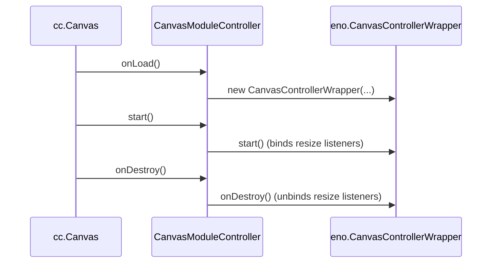

# 🔄 CanvasModuleController Lifecycle Flowchart

---

## 1. Lifecycle Flow

```mermaid
sequenceDiagram
    participant Canvas as cc.Canvas
    participant Controller as CanvasModuleController
    participant Wrapper as eno.CanvasControllerWrapper

    Canvas->>Controller: onLoad()
    Controller->>Wrapper: new CanvasControllerWrapper(...)
    Canvas->>Controller: start()
    Controller->>Wrapper: start() (binds resize listeners)
    Canvas->>Controller: onDestroy()
    Controller->>Wrapper: onDestroy() (unbinds resize listeners)
```
