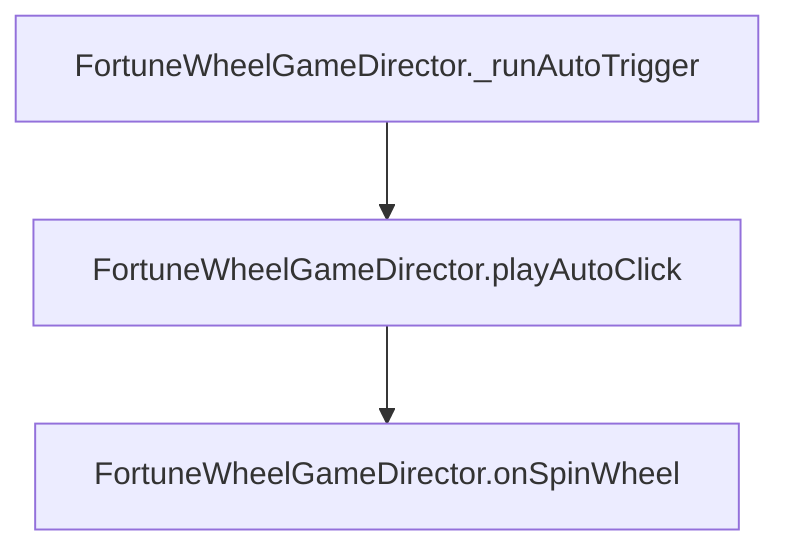

# `FortuneWheelGameDirector.playAutoClick(): void`

---

## 1. Method Signature
```typescript
public playAutoClick(): void
```

---

## 2. Trigger Source & Lifecycle
* **Invoker**: Called by `_runAutoTrigger()` upon countdown timer expiration or when auto-play is forced by parent director.
* **Purpose**: Polymorphic override of `BonusGameDirectorModule.playAutoClick()`.

---

## 3. Detailed Algorithmic Execution Logic
1. **Redirects to Spin Action**: Calls `this.onSpinWheel()`, initiating the wheel spin sequence and backend request.

---

## 4. Caller & Callee Relationship


---

## 5. Un-truncated Source Code Implementation
```typescript
playAutoClick(): void {
	this.onSpinWheel();
}
```
