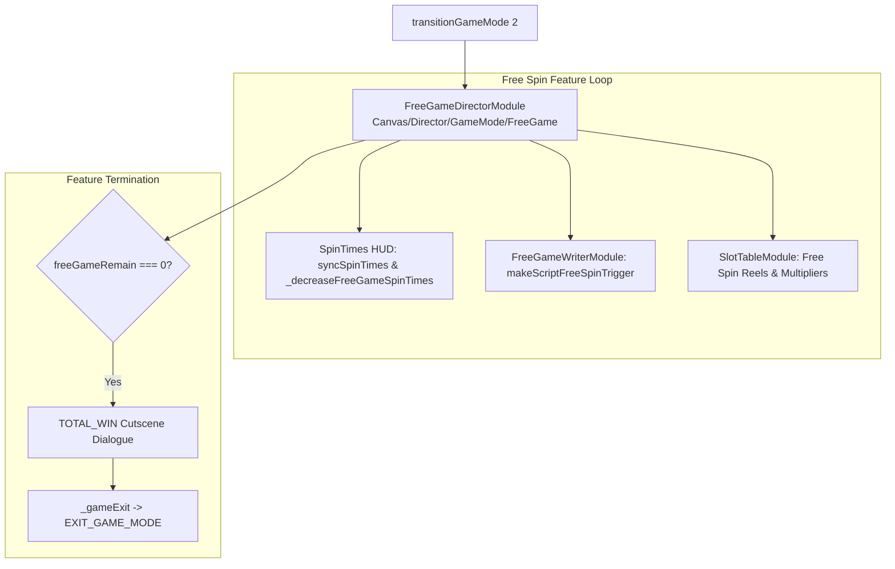

# 🏛️ FreeGameDirectorModule Free Spins Feature Orchestrator Architecture

## 1. Executive Summary & Purpose

`FreeGameDirectorModule` (`assets/cc-common/cc-slot-module/GameMode/FreeGame/FreeGameDirectorModule.ts`) is the **Free Spins Feature Director** in the `cc-common` Slot SDK.

Extending `GameModeDirectorModule`, it governs the automatic spin loop of Free Games (`GAME_MODE_ENUM.FREE_GAME`). It manages the Free Spin countdown counter HUD (`SpinTimesModule`), decrements remaining spins before each turn, handles re-triggers (extra free spins), coordinates progressive win multipliers, and executes the concluding Total Win summary celebration before exiting back to Base Game.

---

## 2. Core Responsibilities

1. **Free Spin Counter Synchronization (`syncSpinTimes`, `_decreaseFreeGameSpinTimes`)**: Synchronizes `freeGameRemain` with `SpinTimesModule` label on entry and decrements count per spin.
2. **Automated Continuous Spinning**: Drives successive free spin rounds automatically without requiring player button clicks.
3. **Session Reconnection Handling (`isResume`)**: Re-establishes remaining spin counters and accumulated multiplier state upon reconnect.
4. **Feature Completion & Summary Presentation (`getFreeGameEndScript`)**: Triggers `TOTAL_WIN` cutscene dialogue and cleanly returns control to `NormalGameDirectorModule`.
