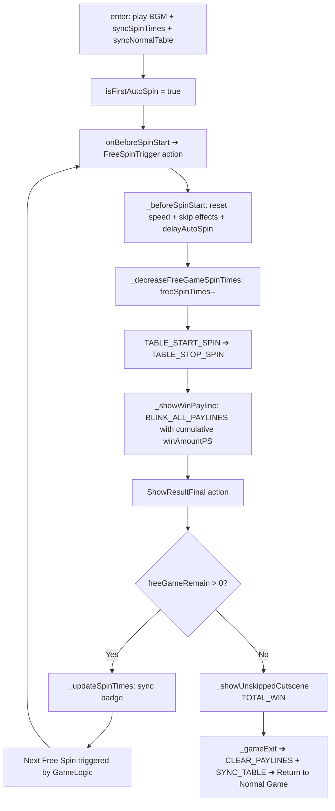

# 🔄 FreeGameDirectorModule Lifecycle & Auto-Spin Flowchart

## 1. Free Spins Lifecycle Flowchart

```mermaid
graph TD
    Enter[enter: play BGM + syncSpinTimes + syncNormalTable] --> MarkFirst[isFirstAutoSpin = true]
    
    MarkFirst --> SpinStart[onBeforeSpinStart ➔ FreeSpinTrigger action]
    SpinStart --> BeforeSpin[_beforeSpinStart: reset speed + skip effects + delayAutoSpin]
    
    BeforeSpin --> Decrement[_decreaseFreeGameSpinTimes: freeSpinTimes--]
    Decrement --> SpinReels[TABLE_START_SPIN ➔ TABLE_STOP_SPIN]
    
    SpinReels --> ShowWin[_showWinPayline: BLINK_ALL_PAYLINES with cumulative winAmountPS]
    ShowWin --> ResultFinal[ShowResultFinal action]
    
    ResultFinal --> CheckSpins{freeGameRemain > 0?}
    CheckSpins -->|Yes| UpdateBadge[_updateSpinTimes: sync badge]
    UpdateBadge --> AutoNext[Next Free Spin triggered by GameLogic]
    AutoNext --> SpinStart
    
    CheckSpins -->|No| FinalWin[_showUnskippedCutscene TOTAL_WIN]
    FinalWin --> Exit[_gameExit ➔ CLEAR_PAYLINES + SYNC_TABLE ➔ Return to Normal Game]
```
