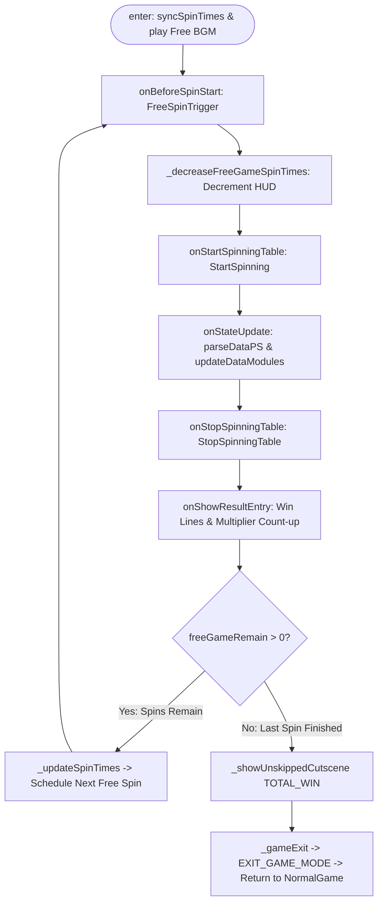

# 🔄 FreeGameDirectorModule Automated Spin Lifecycle Flowchart

## 1. Free Spins Automated State Flowchart

```mermaid
graph TD
    Entry([enter: syncSpinTimes & play Free BGM]) --> Prep[onBeforeSpinStart: FreeSpinTrigger]
    Prep --> Decr[_decreaseFreeGameSpinTimes: Decrement HUD]
    Decr --> Start[onStartSpinningTable: StartSpinning]
    Start --> Rec[onStateUpdate: parseDataPS & updateDataModules]
    Rec --> Stop[onStopSpinningTable: StopSpinningTable]
    Stop --> Win[onShowResultEntry: Win Lines & Multiplier Count-up]
    
    Win --> RemainCheck{freeGameRemain > 0?}
    RemainCheck -->|Yes: Spins Remain| SyncCount[_updateSpinTimes -> Schedule Next Free Spin]
    SyncCount --> Prep
    
    RemainCheck -->|No: Last Spin Finished| TotalWin[_showUnskippedCutscene TOTAL_WIN]
    TotalWin --> Exit[_gameExit -> EXIT_GAME_MODE -> Return to NormalGame]
```
