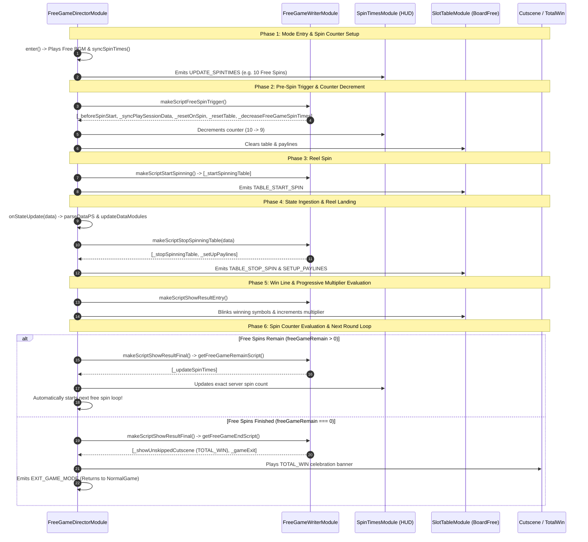

# 🌀 FreeGameDirectorModule 8-Phase Free Spin Loop Breakdown

## 1. Free Spin Automated Execution Pipeline

Unlike Base Game, Free Game spins execute in an automated sequence without requiring player touch input:

