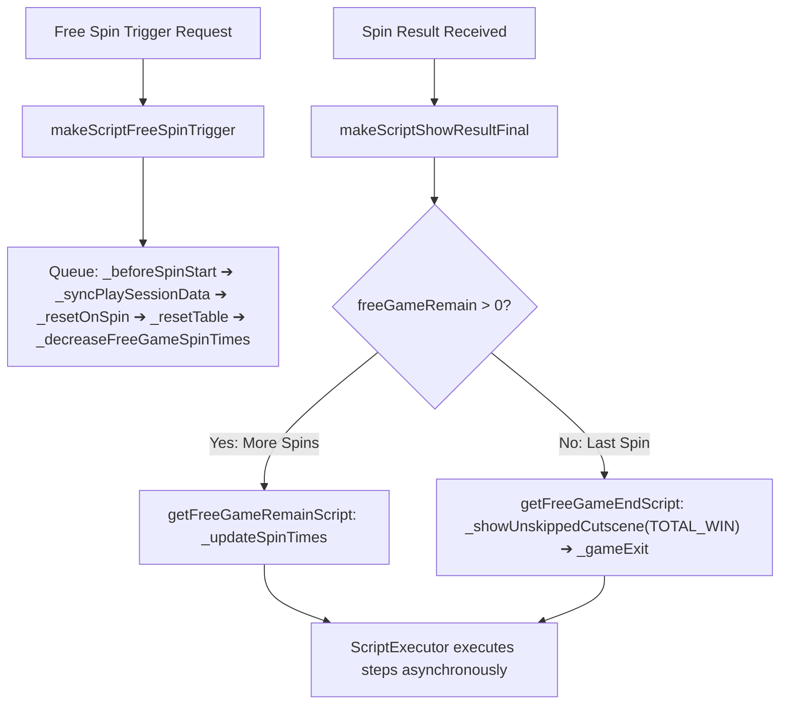

# 🔄 FreeGameWriterModule Script Synthesis Lifecycle Flowchart

## 1. Free Spins Script Generation Flowchart

```mermaid
graph TD
    Trigger[Free Spin Trigger Request] --> GenTrigger[makeScriptFreeSpinTrigger]
    GenTrigger --> SpinQueue["Queue: _beforeSpinStart ➔ _syncPlaySessionData ➔ _resetOnSpin ➔ _resetTable ➔ _decreaseFreeGameSpinTimes"]
    
    Result[Spin Result Received] --> GenResult[makeScriptShowResultFinal]
    GenResult --> CheckRemain{freeGameRemain > 0?}
    
    CheckRemain -->|Yes: More Spins| RemainQueue[getFreeGameRemainScript: _updateSpinTimes]
    CheckRemain -->|No: Last Spin| EndQueue["getFreeGameEndScript: _showUnskippedCutscene(TOTAL_WIN) ➔ _gameExit"]
    
    RemainQueue --> Exec[ScriptExecutor executes steps asynchronously]
    EndQueue --> Exec
```
