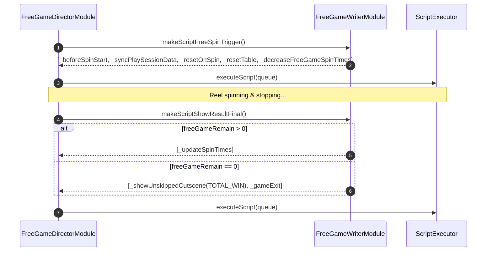

# 🌀 FreeGameWriterModule Free Spin Sequence Breakdown

## 1. Sequence Execution

```mermaid
sequenceDiagram
    autonumber
    participant Director as FreeGameDirectorModule
    participant Writer as FreeGameWriterModule
    participant Executor as ScriptExecutor

    Director->>Writer: makeScriptFreeSpinTrigger()
    Writer-->>Director: [_beforeSpinStart, _syncPlaySessionData, _resetOnSpin, _resetTable, _decreaseFreeGameSpinTimes]
    Director->>Executor: executeScript(queue)
    
    Note over Director,Executor: Reel spinning & stopping...
    
    Director->>Writer: makeScriptShowResultFinal()
    alt freeGameRemain > 0
        Writer-->>Director: [_updateSpinTimes]
    else freeGameRemain == 0
        Writer-->>Director: [_showUnskippedCutscene(TOTAL_WIN), _gameExit]
    end
    Director->>Executor: executeScript(queue)
```
