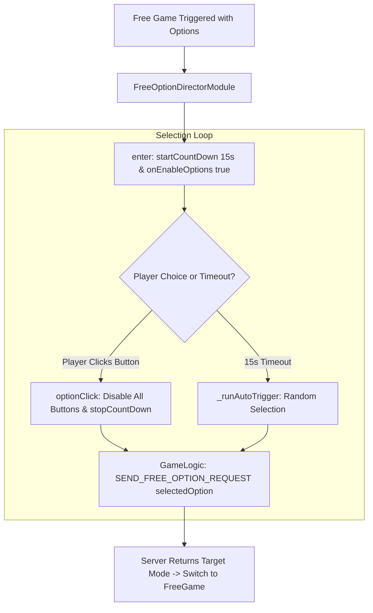

# 🏛️ FreeOptionDirectorModule Free Spins Option Choice Modal Architecture

## 1. Executive Summary & Purpose

`FreeOptionDirectorModule` (`assets/cc-common/cc-slot-module/GameMode/FreeOption/FreeOptionDirectorModule.ts`) is the **Free Spins Volatility Selection Director**.

Extending `GameModeDirectorModule`, it presents a multi-choice modal allowing players to choose their preferred Free Spin mode (e.g. 15 Free Spins with 2x multiplier vs 5 Free Spins with 10x multiplier vs Mystery Choice). It enforces a 15-second countdown timer (`countdownTime`), auto-selects an option on timeout, locks user inputs upon selection, and emits `GameLogicUIEvents.SEND_FREE_OPTION_REQUEST` to backend servers.

---

## 2. Core Responsibilities

1. **Multi-Choice Presentation (`onEnableOptions`)**: Configures option buttons defined in the `options: SlotCustomFreeGameOption[]` Inspector array.
2. **Countdown Timer (`startCountDown`)**: Decrements countdown timer every second and updates UI text.
3. **Double-Click Prevention (`optionClick`)**: Immediately disables all option buttons (`interactable = false`) upon first click.
4. **Backend Event Dispatch**: Emits `SEND_FREE_OPTION_REQUEST` with the chosen `optionId`.
