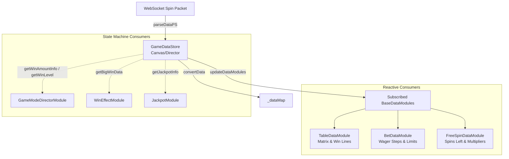

# 🏛️ GameDataStore Central Reactive State Architecture

## 1. Executive Summary & Purpose

`GameDataStore` (`assets/cc-common/cc-slot-module/Core/GameDataStore.ts`) is the **Central Reactive Data Hub** of the `cc-common` Slot SDK.

Mounted at `Canvas/Director`, `GameDataStore` ingests raw WebSocket spin response packets from the game server, stores the active spin payload (`playSession`), converts payload keys into internal reactive maps, and automatically broadcasts changes to subscribed child components (`BaseDataModule`) using deep-cloned immutable snapshots.

---

## 2. Core Responsibilities

1. **Spin Session Storage (`playSession`)**: Caches current round data (symbol matrices, win lines, total payout, jackpot hits, next game mode).
2. **Reactive Module Synchronization**: Dispatches data updates to all child `BaseDataModule` components matching their `registeredKeys`.
3. **Win Calculation & Threshold Evaluation**: Computes `rate = FloatUtils.div(win, totalBet)` against `GameConfig.WIN_LEVEL_CONFIG.THRESHOLDS` to determine Win Levels 1..4, coin rolling duration, and payline highlight time.
4. **Jackpot Payload Parsing**: Extracts tier strings (e.g. `GRAND`, `MAJOR`, `MINI`) and numeric reward values from socket strings like `['9000_4_GRAND;2500000']`.
