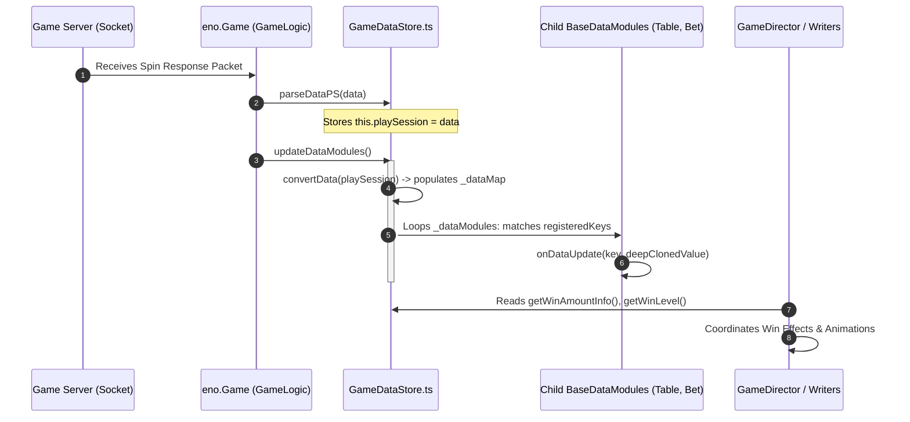

# 🔄 GameDataStore Reactive Spin Pipeline Flowchart

## 1. Sequence Diagram: Ingestion & Broadcast

```mermaid
sequenceDiagram
    autonumber
    participant Server as Game Server (Socket)
    participant GL as eno.Game (GameLogic)
    participant GDS as GameDataStore.ts
    participant BDM as Child BaseDataModules (Table, Bet)
    participant Dir as GameDirector / Writers

    Server->>GL: Receives Spin Response Packet
    GL->>GDS: parseDataPS(data)
    Note over GDS: Stores this.playSession = data
    
    GL->>GDS: updateDataModules()
    activate GDS
    GDS->>GDS: convertData(playSession) -> populates _dataMap
    GDS->>BDM: Loops _dataModules: matches registeredKeys
    BDM->>BDM: onDataUpdate(key, deepClonedValue)
    deactivate GDS

    Dir->>GDS: Reads getWinAmountInfo(), getWinLevel()
    Dir->>Dir: Coordinates Win Effects & Animations
```
