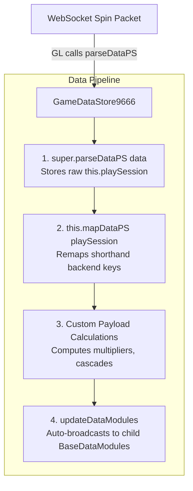

# 🏗️ GameDataStore Subclassing & Data Ingestion Guide

## 1. Class Inheritance Declaration

When creating a new slot game (e.g. Red Cliff `g9666L`), inherit from `GameDataStore` and attach it to the root **`Canvas/Director`** node:

```typescript
const { _decorator } = cc;
import { GameDataStore } from "../../../../cc-common/cc-slot-module/SlotModuleExport";
const { ccclass } = _decorator;

@ccclass("GameDataStore9666")
export class GameDataStore9666 extends GameDataStore {
    // Override points here
}
```

---

## 2. Where & How Data Is Parsed (`parseDataPS`)

The primary data ingestion entry point is **`parseDataPS(data: any): void`**:



### The 3-Step Ingestion Pattern:
1. **Call `super.parseDataPS(data)`**: Ensures base caching and console debug logging.
2. **Execute `this.mapDataPS(data)`**: Remap backend shorthand keys (e.g. `pMul`, `cna`) to readable SDK keys using `this.mapNewKeys()`.
3. **Compute Derivative State**: Calculate extra game-specific metrics (e.g. total multiplier step) before `updateDataModules()` fires.
