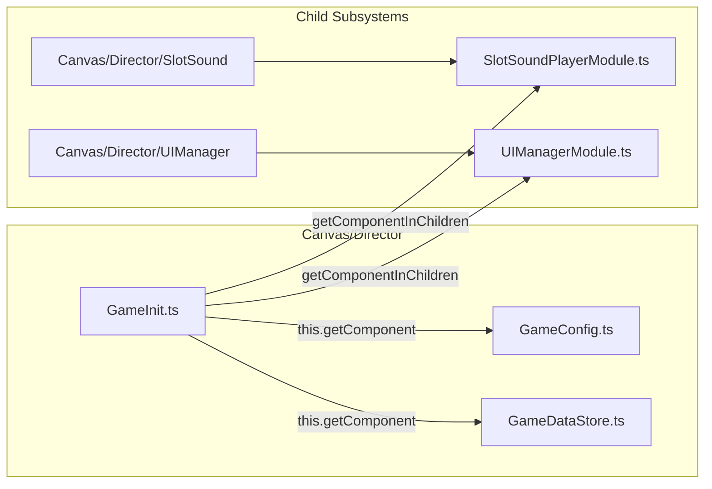

# 🌳 GameInit Canonical Scene Node & Prefab Hierarchy

## 1. Canonical Scene Anchor (`g9000L.fire`)

`GameInit` is permanently attached to the root **`Canvas/Director`** node in all standard template scenes (`g9000L.fire`, `g9000H.fire`, `g9000P.fire`).

```text
Canvas (cc.Canvas)
└── Canvas/Director [GameInit.ts, GameConfig.ts, GameDataStore.ts, GameDirector.ts]
    ├── Canvas/Director/GameMode        ➔ (GameModeDirectorModule)
    ├── Canvas/Director/UIManager       ➔ (UIManagerModule, BetModule, WalletModule)
    ├── Canvas/Director/SlotSound       ➔ (SlotSoundPlayerModule)
    ├── Canvas/Director/CutsceneControl ➔ (CutsceneController, WinEffectModule)
    └── Canvas/Director/PopupControl    ➔ (PopupControllerModule)
```

---

## 2. Co-located Components on `Canvas/Director`

`GameInit` expects the following companion components to be mounted on either the same node or immediate sibling/child nodes:

| Component Name | Node Location | Relationship to `GameInit` |
| :--- | :--- | :--- |
| **`GameConfig`** | `Canvas/Director` | Resolved via `this.getComponent(GameConfig)` or auto-added. Provides `GAME_ID`, `PAY_SYSTEM`, and `TABLE_FORMAT`. |
| **`GameDataStore`** | `Canvas/Director` | Resolved via `this.getComponent(GameDataStore)`. Configured with `_gameConfig`. |
| **`UIManagerModule`** | `Canvas/Director/UIManager` | Located via `this.getComponentInChildren(UIManagerModule)` and provided to IoC. |
| **`SlotSoundPlayerModule`** | `Canvas/Director/SlotSound` | Located via `this.getComponentInChildren(SlotSoundPlayerModule)` and provided to IoC. |

---

## 3. Companion Subsystems Discovered on Boot


