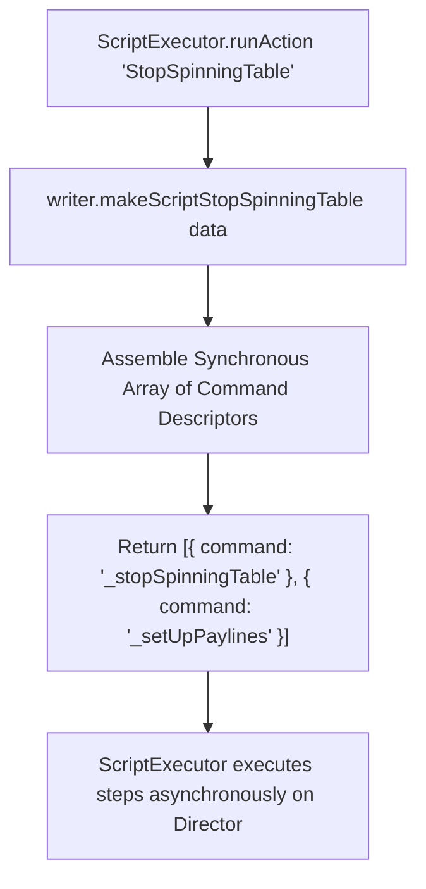

# 🔄 GameModeWriterModule Script Generation Flowchart

## 1. Declarative Generation Flowchart

```mermaid
graph TD
    Exec[ScriptExecutor.runAction 'StopSpinningTable'] --> Call[writer.makeScriptStopSpinningTable data]
    Call --> Pure[Assemble Synchronous Array of Command Descriptors]
    Pure --> Ret["Return [{ command: '_stopSpinningTable' }, { command: '_setUpPaylines' }]"]
    Ret --> StepLoop[ScriptExecutor executes steps asynchronously on Director]
```
