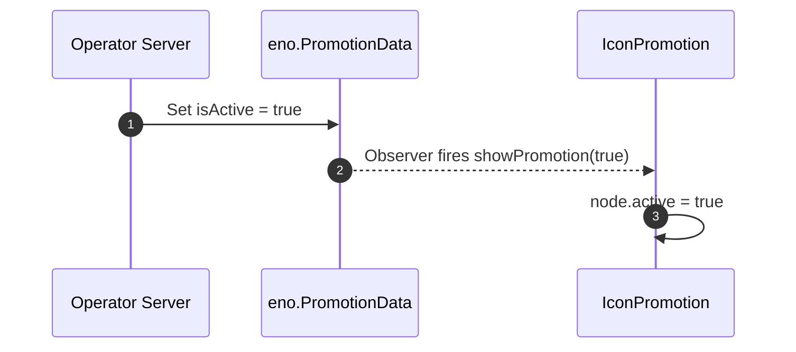

# 🔄 IconPromotion Lifecycle Flowchart

---

## 1. Sequence Flowchart

```mermaid
sequenceDiagram
    autonumber
    participant Server as Operator Server
    participant Model as eno.PromotionData
    participant IP as IconPromotion

    Server->>Model: Set isActive = true
    Model-->>IP: Observer fires showPromotion(true)
    IP->>IP: node.active = true
```
