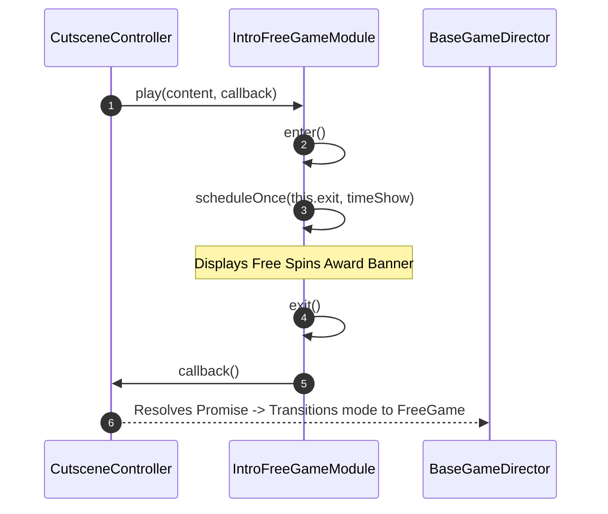

# 🔄 IntroFreeGameModule Lifecycle Sequence Flowchart

---

## 1. Sequence Flowchart

```mermaid
sequenceDiagram
    autonumber
    participant CC as CutsceneController
    participant IFG as IntroFreeGameModule
    participant Director as BaseGameDirector

    CC->>IFG: play(content, callback)
    IFG->>IFG: enter()
    IFG->>IFG: scheduleOnce(this.exit, timeShow)
    Note over IFG: Displays Free Spins Award Banner
    IFG->>IFG: exit()
    IFG->>CC: callback()
    CC-->>Director: Resolves Promise -> Transitions mode to FreeGame
```
