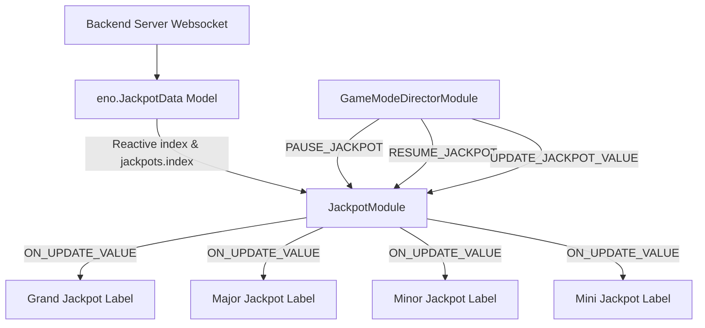

# 🏛️ JackpotModule Architectural Role & Progressive Jackpot HUD

---

## 1. Architectural Mission

`JackpotModule` manages progressive jackpot banner scoreboards mounted under `Canvas/Director/Jackpot`. It supports multi-tier jackpots (`GRAND`, `MAJOR`, `MINOR`, `MINI`), synchronizing with backend websocket feeds via `eno.JackpotData` (`jackpots[betIndex]`), handling rolling number animation interpolation (`JackpotLabel` with `MoneyTween`), and managing pause/resume states during celebratory jackpot cutscenes.

---

## 2. Key Responsibilities

1. **Multi-Tier Progressive Rendering (`renderAllJackpot`)**:
   - Updates Grand, Major, Minor, Mini labels using progressive count-up time ($3.0\text{s}$).
2. **Bet Denomination Sync (`setupObserver` on `index`)**:
   - Re-binds nested observers whenever the player modifies their bet index, instantly switching to the corresponding jackpot tier values.
3. **Celebration Lockout (`pauseJackpot` / `resumeJackpot`)**:
   - Freezes progressive number ticking while the player is experiencing a Jackpot Win cutscene.
