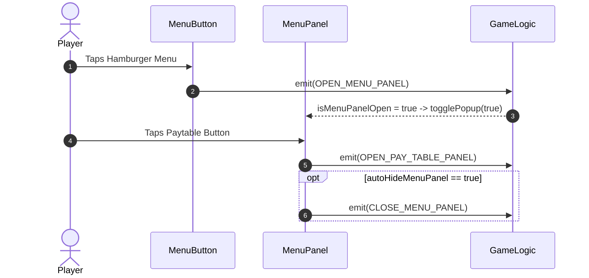

# 🔄 MenuPanel Lifecycle Flowchart

---

## 1. Drawer Navigation Flow

```mermaid
sequenceDiagram
    autonumber
    actor Player
    participant UI as MenuButton
    participant Drawer as MenuPanel
    participant Logic as GameLogic

    Player->>UI: Taps Hamburger Menu
    UI->>Logic: emit(OPEN_MENU_PANEL)
    Logic-->>Drawer: isMenuPanelOpen = true -> togglePopup(true)

    Player->>Drawer: Taps Paytable Button
    Drawer->>Logic: emit(OPEN_PAY_TABLE_PANEL)
    opt autoHideMenuPanel == true
        Drawer->>Logic: emit(CLOSE_MENU_PANEL)
    end
```
