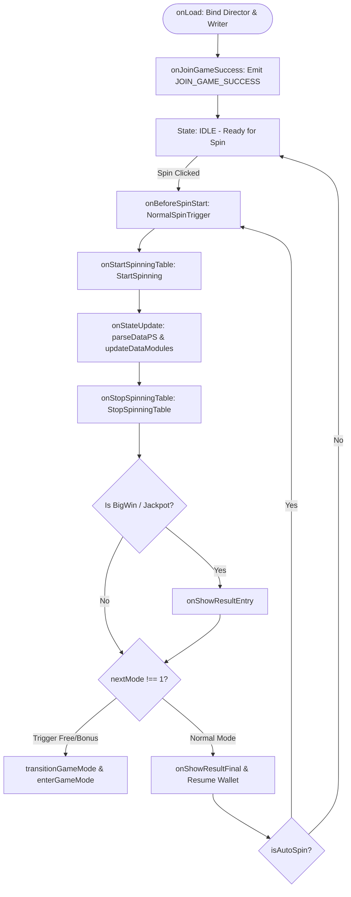

# 🔄 NormalGameDirectorModule Lifecycle & Spin Flowchart

## 1. Normal Game Spin Flowchart

```mermaid
graph TD
    Start([onLoad: Bind Director & Writer]) --> Join[onJoinGameSuccess: Emit JOIN_GAME_SUCCESS]
    Join --> Idle[State: IDLE - Ready for Spin]
    
    Idle -->|Spin Clicked| Trigger[onBeforeSpinStart: NormalSpinTrigger]
    Trigger --> StartSpin[onStartSpinningTable: StartSpinning]
    StartSpin --> ServerRec[onStateUpdate: parseDataPS & updateDataModules]
    ServerRec --> StopSpin[onStopSpinningTable: StopSpinningTable]
    
    StopSpin --> WinCheck{Is BigWin / Jackpot?}
    WinCheck -->|Yes| ShowEntry[onShowResultEntry]
    WinCheck -->|No| ModeCheck
    ShowEntry --> ModeCheck{nextMode !== 1?}
    
    ModeCheck -->|Trigger Free/Bonus| Transition[transitionGameMode & enterGameMode]
    ModeCheck -->|Normal Mode| Settle[onShowResultFinal & Resume Wallet]
    
    Settle --> AutoCheck{isAutoSpin?}
    AutoCheck -->|Yes| Trigger
    AutoCheck -->|No| Idle
```
