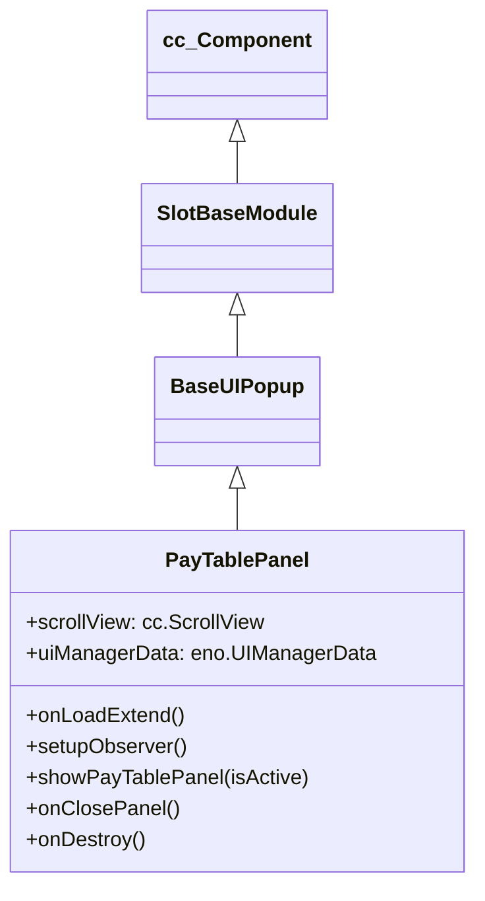

# 🏛️ PayTablePanel Architecture & Role

`PayTablePanel` is the mobile vertical paytable scroll viewer in the `cc-common` Slot Framework SDK. Inheriting from `BaseUIPopup`, it provides a smooth scrollable rulebook and symbol multiplier calculator tailored for portrait aspect ratios.

---

## 1. Architectural Role

- **Vertical Paytable Viewer**: Manages `scrollView: cc.ScrollView` and resets scroll position to the top on every open.
- **Reactive Model Observer**: Observes `UIManagerData.isPayTablePanelOpen` to toggle popup visibility.
- **Modal Lifecycle**: Emits `CLOSE_PAY_TABLE_PANEL` when dismissed.

---

## 2. Inheritance Diagram

