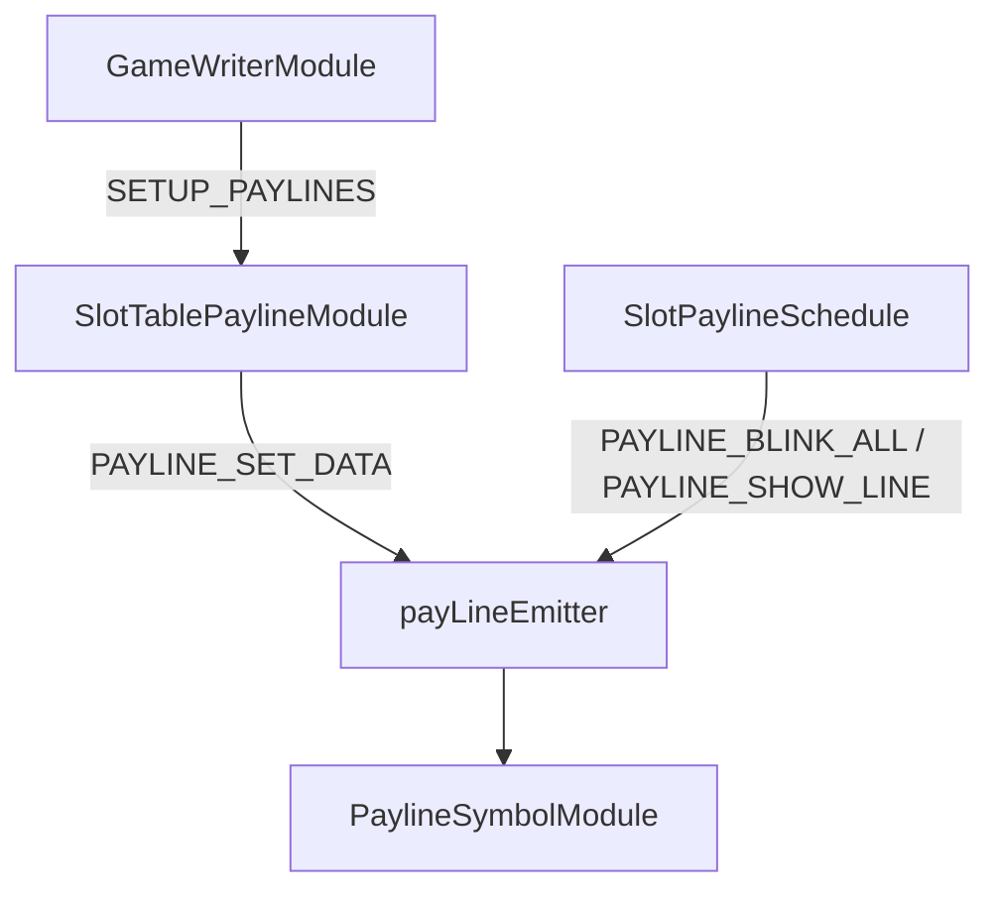

# 🎼 PaylineSymbolModule Pipeline Orchestration

---

## 1. Interaction Pipeline

Controlled indirectly via `SlotTablePaylineModule` and `SlotPaylineSchedule`:

```mermaid
graph TD
    Writer[GameWriterModule] -->|SETUP_PAYLINES| PM[SlotTablePaylineModule]
    PM -->|PAYLINE_SET_DATA| Emitter[payLineEmitter]
    Schedule[SlotPaylineSchedule] -->|PAYLINE_BLINK_ALL / PAYLINE_SHOW_LINE| Emitter
    Emitter --> PSM[PaylineSymbolModule]
```
