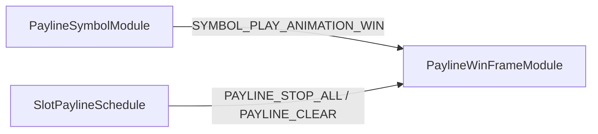

# 🎼 PaylineWinFrameModule Pipeline Orchestration

---

## 1. Interaction Pipeline

Acts as a follower module responding to events dispatched by `PaylineSymbolModule` and `SlotPaylineSchedule`:

```mermaid
graph LR
    PSM[PaylineSymbolModule] -->|SYMBOL_PLAY_ANIMATION_WIN| PWFM[PaylineWinFrameModule]
    Sched[SlotPaylineSchedule] -->|PAYLINE_STOP_ALL / PAYLINE_CLEAR| PWFM
```
