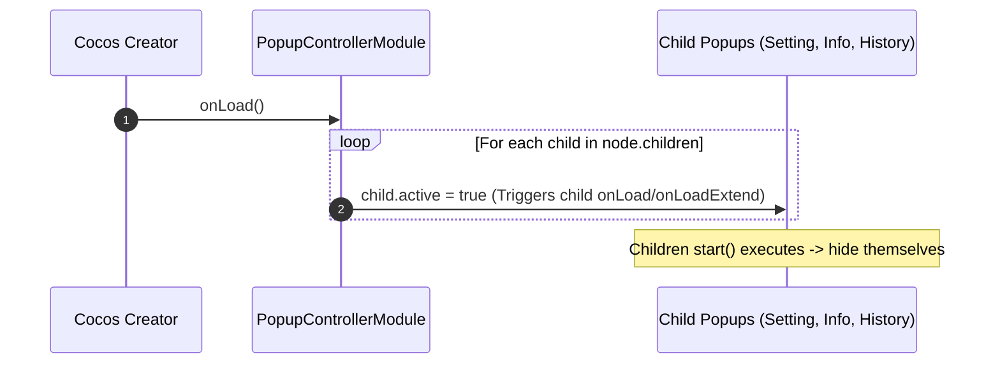

# 🔄 PopupControllerModule Lifecycle Flowchart

---

## 1. Sequence Flowchart

```mermaid
sequenceDiagram
    autonumber
    participant Engine as Cocos Creator
    participant PCM as PopupControllerModule
    participant Children as Child Popups (Setting, Info, History)

    Engine->>PCM: onLoad()
    loop For each child in node.children
        PCM->>Children: child.active = true (Triggers child onLoad/onLoadExtend)
    end
    Note over Children: Children start() executes -> hide themselves
```
