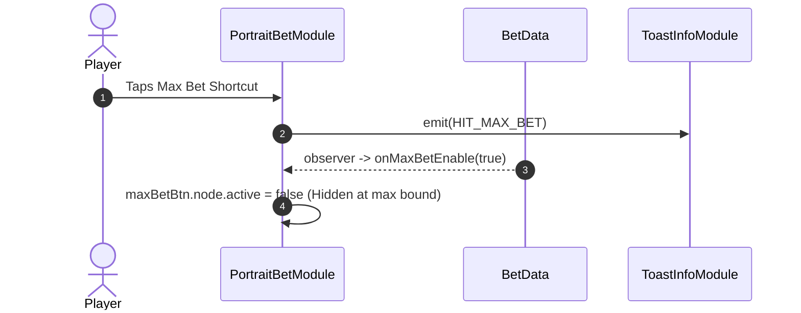

# 🔄 PortraitBetModule Lifecycle Flowchart

---

## 1. Bet Boundary Flow

```mermaid
sequenceDiagram
    autonumber
    actor Player
    participant HUD as PortraitBetModule
    participant Data as BetData
    participant Toast as ToastInfoModule

    Player->>HUD: Taps Max Bet Shortcut
    HUD->>Toast: emit(HIT_MAX_BET)
    Data-->>HUD: observer -> onMaxBetEnable(true)
    HUD->>HUD: maxBetBtn.node.active = false (Hidden at max bound)
```
