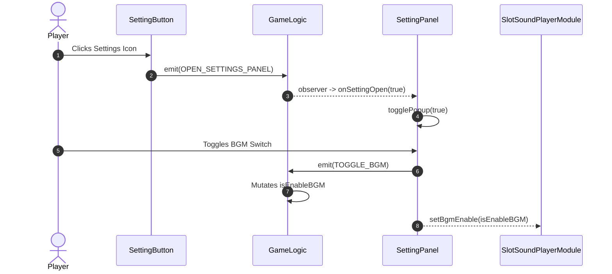

# 🔄 SettingPanel Lifecycle Flowchart

---

## 1. Settings Flow

```mermaid
sequenceDiagram
    autonumber
    actor Player
    participant UI as SettingButton
    participant Logic as GameLogic
    participant Panel as SettingPanel
    participant Sound as SlotSoundPlayerModule

    Player->>UI: Clicks Settings Icon
    UI->>Logic: emit(OPEN_SETTINGS_PANEL)
    Logic-->>Panel: observer -> onSettingOpen(true)
    Panel->>Panel: togglePopup(true)

    Player->>Panel: Toggles BGM Switch
    Panel->>Logic: emit(TOGGLE_BGM)
    Logic->>Logic: Mutates isEnableBGM
    Panel-->>Sound: setBgmEnable(isEnableBGM)
```
