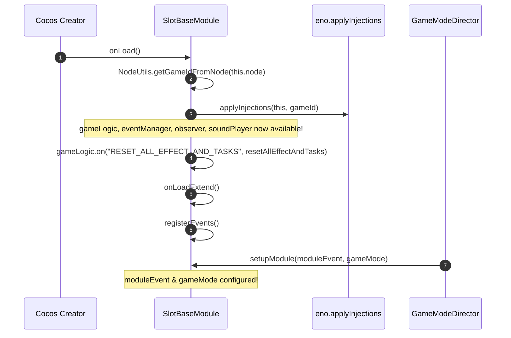

# 🔄 SlotBaseModule Lifecycle Flowchart

---

## 1. Lifecycle Sequence Flowchart

```mermaid
sequenceDiagram
    autonumber
    participant Engine as Cocos Creator
    participant SBM as SlotBaseModule
    participant DI as eno.applyInjections
    participant GMD as GameModeDirector

    Engine->>SBM: onLoad()
    SBM->>SBM: NodeUtils.getGameIdFromNode(this.node)
    SBM->>DI: applyInjections(this, gameId)
    Note over SBM: gameLogic, eventManager, observer, soundPlayer now available!
    
    SBM->>SBM: gameLogic.on("RESET_ALL_EFFECT_AND_TASKS", resetAllEffectAndTasks)
    SBM->>SBM: onLoadExtend()
    SBM->>SBM: registerEvents()
    
    GMD->>SBM: setupModule(moduleEvent, gameMode)
    Note over SBM: moduleEvent & gameMode configured!
```
