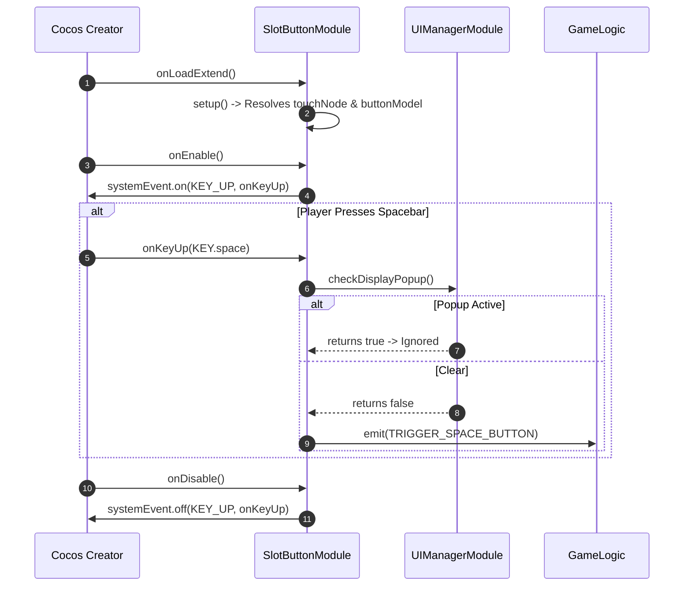

# 🔄 SlotButtonModule Lifecycle Sequence Flowchart

---

## 1. Sequence Flowchart

```mermaid
sequenceDiagram
    autonumber
    participant Engine as Cocos Creator
    participant SBM as SlotButtonModule
    participant UIM as UIManagerModule
    participant GL as GameLogic

    Engine->>SBM: onLoadExtend()
    SBM->>SBM: setup() -> Resolves touchNode & buttonModel
    Engine->>SBM: onEnable()
    SBM->>Engine: systemEvent.on(KEY_UP, onKeyUp)
    
    alt Player Presses Spacebar
        Engine->>SBM: onKeyUp(KEY.space)
        SBM->>UIM: checkDisplayPopup()
        alt Popup Active
            UIM-->>SBM: returns true -> Ignored
        else Clear
            UIM-->>SBM: returns false
            SBM->>GL: emit(TRIGGER_SPACE_BUTTON)
        end
    end
    
    Engine->>SBM: onDisable()
    SBM->>Engine: systemEvent.off(KEY_UP, onKeyUp)
```
