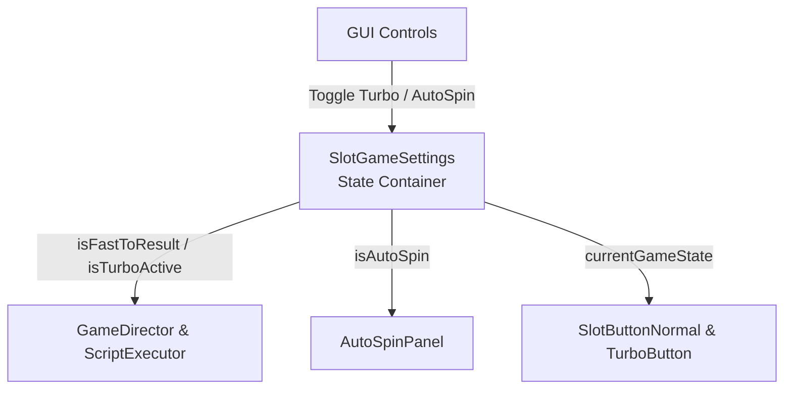

# 🏛️ SlotGameSettings User Preferences & Runtime Flags Architecture

## 1. Executive Summary & Purpose

`SlotGameSettings` (`assets/cc-common/cc-slot-module/Core/SlotGameSettings.ts`) is the **State & User Preference Registry** of the `cc-common` Slot SDK.

Provided to the IoC container by `GameInit`, it maintains live runtime flags including Turbo Mode state (`isTurboActive`), Auto-Spin status (`isAutoSpin`), current game speed (`gameSpeed`), trial mode state (`isTrialMode`), and login authorization state (`isJoinGameSuccess`).

---

## 2. Core Responsibilities

1. **Turbo & Game Speed Management**: Exposes `isTurboActive`, `gameSpeed`, and `isFastToResult` (`gameSpeed === GAME_SPEED_ENUM.INSTANTLY`).
2. **Auto Spin Coordination**: Tracks active auto-spin loop state.
3. **Session Context Verification**: Stores `isJoinGameSuccess` preventing premature spin submissions.
