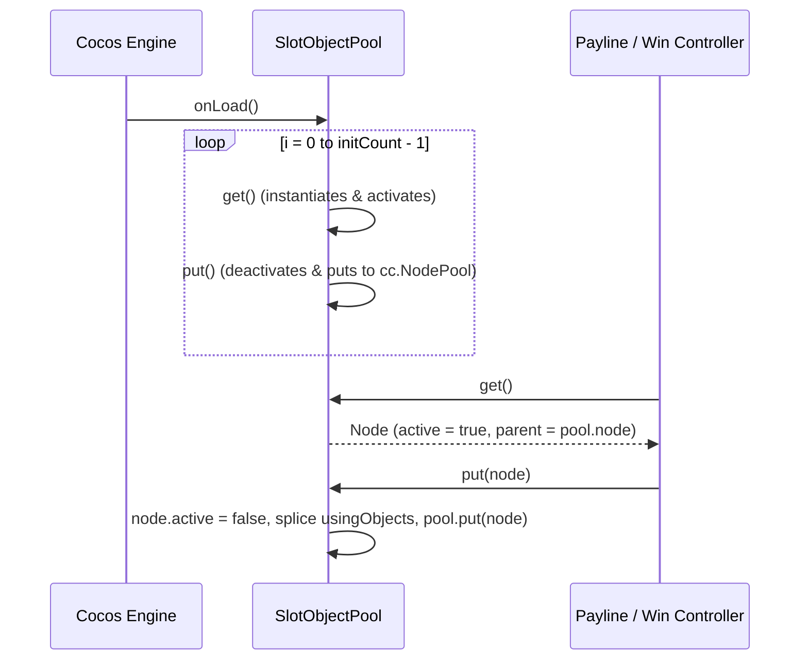

# 🔄 SlotObjectPool Lifecycle & Sequence Diagram

---

## 1. Allocation & Recycling Lifecycle

```mermaid
sequenceDiagram
    participant Engine as Cocos Engine
    participant Pool as SlotObjectPool
    participant Client as Payline / Win Controller

    Engine->>Pool: onLoad()
    loop i = 0 to initCount - 1
        Pool->>Pool: get() (instantiates & activates)
        Pool->>Pool: put() (deactivates & puts to cc.NodePool)
    end

    Client->>Pool: get()
    Pool-->>Client: Node (active = true, parent = pool.node)

    Client->>Pool: put(node)
    Pool->>Pool: node.active = false, splice usingObjects, pool.put(node)
```
