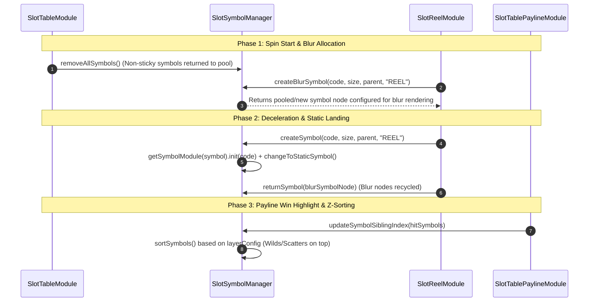

# 🌀 SlotSymbolManager Spin Phase Recycling Breakdown

## 1. Spin Lifecycle Interactions

```mermaid
sequenceDiagram
    autonumber
    participant Table as SlotTableModule
    participant Manager as SlotSymbolManager
    participant Reel as SlotReelModule
    participant Payline as SlotTablePaylineModule

    Note over Table,Payline: Phase 1: Spin Start & Blur Allocation
    Table->>Manager: removeAllSymbols() (Non-sticky symbols returned to pool)
    Reel->>Manager: createBlurSymbol(code, size, parent, "REEL")
    Manager-->>Reel: Returns pooled/new symbol node configured for blur rendering

    Note over Table,Payline: Phase 2: Deceleration & Static Landing
    Reel->>Manager: createSymbol(code, size, parent, "REEL")
    Manager->>Manager: getSymbolModule(symbol).init(code) + changeToStaticSymbol()
    Reel->>Manager: returnSymbol(blurSymbolNode) (Blur nodes recycled)

    Note over Table,Payline: Phase 3: Payline Win Highlight & Z-Sorting
    Payline->>Manager: updateSymbolSiblingIndex(hitSymbols)
    Manager->>Manager: sortSymbols() based on layerConfig (Wilds/Scatters on top)
```
