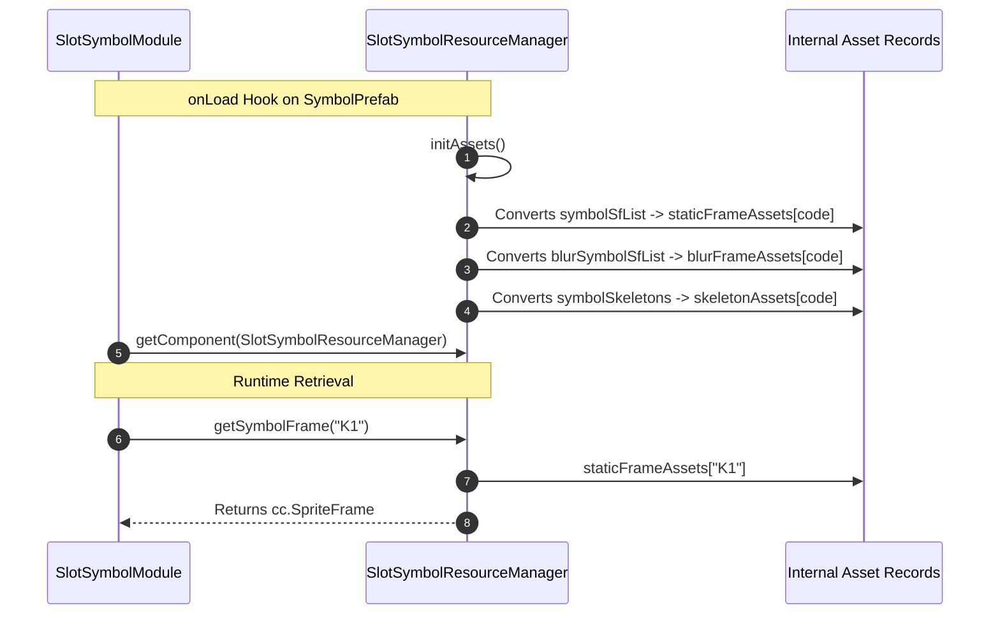

# 🔄 SlotSymbolResourceManager Lifecycle & Asset Indexing Flow

---

## 1. Lifecycle Sequence Flowchart

```mermaid
sequenceDiagram
    autonumber
    participant Sym as SlotSymbolModule
    participant Res as SlotSymbolResourceManager
    participant Dict as Internal Asset Records

    Note over Sym,Res: onLoad Hook on SymbolPrefab
    Res->>Res: initAssets()
    Res->>Dict: Converts symbolSfList -> staticFrameAssets[code]
    Res->>Dict: Converts blurSymbolSfList -> blurFrameAssets[code]
    Res->>Dict: Converts symbolSkeletons -> skeletonAssets[code]
    
    Sym->>Res: getComponent(SlotSymbolResourceManager)
    
    Note over Sym,Res: Runtime Retrieval
    Sym->>Res: getSymbolFrame("K1")
    Res->>Dict: staticFrameAssets["K1"]
    Res-->>Sym: Returns cc.SpriteFrame
```
