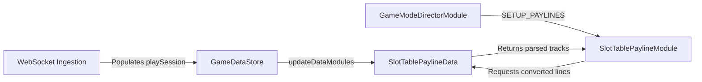

# 🎼 SlotTablePaylineData Pipeline Orchestration

---

## 1. Data Flow in Script Pipeline

```mermaid
graph LR
    WS[WebSocket Ingestion] -->|Populates playSession| DataStore[GameDataStore]
    DataStore -->|updateDataModules| PData[SlotTablePaylineData]
    Director[GameModeDirectorModule] -->|SETUP_PAYLINES| PM[SlotTablePaylineModule]
    PM -->|Requests converted lines| PData
    PData -->|Returns parsed tracks| PM
```
