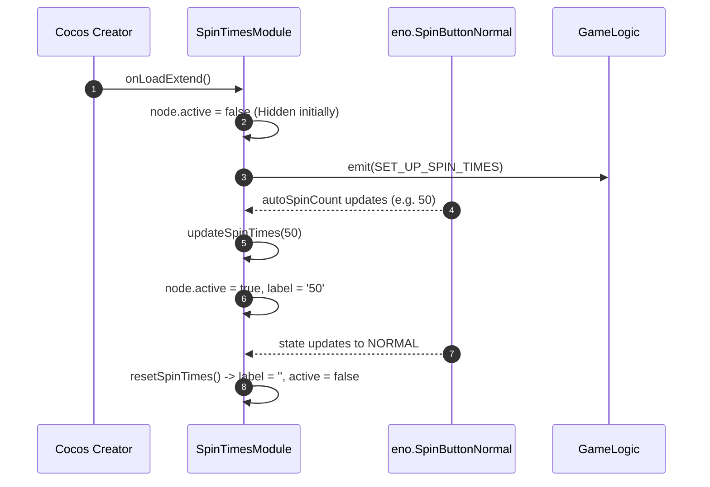

# 🔄 SpinTimesModule Lifecycle Sequence Flowchart

---

## 1. Sequence Flowchart

```mermaid
sequenceDiagram
    autonumber
    participant Engine as Cocos Creator
    participant STM as SpinTimesModule
    participant Model as eno.SpinButtonNormal
    participant GL as GameLogic

    Engine->>STM: onLoadExtend()
    STM->>STM: node.active = false (Hidden initially)
    STM->>GL: emit(SET_UP_SPIN_TIMES)
    
    Model-->>STM: autoSpinCount updates (e.g. 50)
    STM->>STM: updateSpinTimes(50)
    STM->>STM: node.active = true, label = '50'
    
    Model-->>STM: state updates to NORMAL
    STM->>STM: resetSpinTimes() -> label = '', active = false
```
